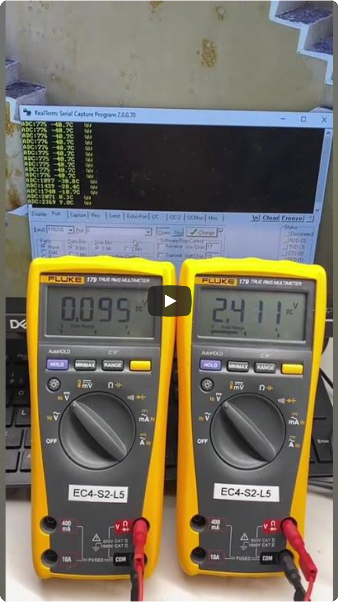

# ADC Temperature measuring project
The purpose of this project is to design a remote temperature measurement system for use in industrial or production environments. Additionally, the project aims to practice analog circuit design, DAC design, and microcontroller programming. In the future, the project may be expanded and upgraded to measure various types of remote sensors and enhance features such as LCD display, web displaying, and cloud storage...
## General requirements: 
- Temperature measurement range: -40 to 60°C 
- Sensor analog processor output voltage: 0-5V (corresponding to -40 to 60°C) 
- Analog signal transmission current: 4-20mA (corresponding to 0-5V) 
- Receiver output voltage: 0.8-4V (corresponding to 4-20mA) 
- DAC processor using SPI interface.
## The main components of this project include:
- LM35 temperature sensor.
- MAX187 serial 12-bit analog-to-digital converter.
- STM32 L152RE microcontroller.
- Other components: LM741/NS op-amp, BC547 transistor, 1N4148 diode, LM317 voltage regulator, resistors, capacitors...

---------------------------------

### 1) Analog  signal  processing
The analog processing circuit design of the LM35 sensor is based on the LM35 datasheet (Fig. 18).
The LM35 has a linear variation characteristic of 10mV/°C. Therefore, with a temperature range of -40 to 60°C, Vout will be -400mV to 600mV. The output of the LM35 consists of V1 and V2 (with V1 - V2 = Vout). V2 is always 1.2V (each diode has a voltage of 0.6V). Therefore, V1(Va) will vary from 0.8 to 1.8V.

The components of the LM35 analog processor are selected and calculated as shown in the figure below. We use a voltage buffer and a differential amplifier to produce a 0-5V output corresponding to Vout from -400mV to 600mV.

Simulating the operation of the analog processing circuit yielded the expected results (0-5V output corresponds to -400mV-600mV, or Va from 0.8V-1.8V).

---------------------------------

### 2) Transmitter 4-20mA
The output signal (0-5V) of the LM35 analog processor will be converted into a 4-20mA current signal and transmitted. There are many methods for designing a 4-20mA circuit. The Texas Instruments reference circuit is an good example that can be implemented in production. However, since the OPA317 op-amp (or equivalent) is not available in the lab, this design uses only LN741/NS op-amps. This circuit is more complex and less stable than the Texas reference circuit.
In this circuit, we use a differential amplifier to convert a 0-5V input to a 1-5V input. To create the input for the differential amplifier, we use a LM317 voltage regulator and a voltage buffer, and combine them with the input to produce a 1-5V voltage.

The output current is 4-20mA, corresponding to 0.8-4V. Therefore, the value of R2 is chosen to be 200Ω. The simulation of the circuit diagram is shown below.

---------------------------------

### 3) Receiver
The 4-20mA current signal will be converted into a 0.8-4V voltage for the MAX 817 ADC. We also calculate R3 if the input signal contains an 8 kV electrostatic discharge voltage. We want the current during this electrostatic discharge event to pass through the diodes at 0.8A.  The input signal contains 8 kV ESD discharge voltage. Therefore, the value of resistor R3 is 10kΩ. Capacitor C1 is used to filter frequencies, creating a stable signal for the MAX187 ADC.

---------------------------------

### 4) Analog to digial converter
We use ADC MAX187 and microcontroller STM32 L152RE for analog to digital processing and getting values of the LM35 sensor. The MAX187 is a low‑power, 12‑bit serial analog‑to‑digital converter (ADC) that operates from a single +5 V supply and includes an internal 4.096 V precision reference, a fast track/hold, and a 3‑wire SPI‑compatible serial interface.
The input voltage is 0.8-4V will be processed by the ADC and microcontroller to output to monitor via USART interface. The program also gives a warning if input below 0.8V, that mean there could be a problem at the transmitter and LM35.
The operational diagram of MAX187 is refered to the fig. 18 of MAX187 datasheet, while the SHDN pin will be connected to the VDD since the internal reference is enable.
 

---------------------------------

## Simulation full circuit diagram and tesing:

We simulated the temperature of the LM35 from -40 to 60 degrees Celsius using the LM35's output voltage from 0.8 to 1.8V. The output was displayed on the computer screen via the USART interface of the STM32 L152RE.
Based on the test results, we can see that the output temperature corresponds to the expected output voltage of the LM35 (from -40 to 60 degrees Celsius, corresponding to 0.8-1.8V). However, due to the unstable voltage of the LM317 at the transmitter, the 4-20mA current is not very stable. In production, the Texas Instruments reference circuit should be applied to maintain a stable 4-20mA output.
(*The designs that simulate the 4-20mA circuit based on the Texas Instruments reference design are shown [here](./LTspice-simulation/TI-4-20mA/)*)

*****************

## References
[LM35 datasheet](./ref/lm35-datasheet.pdf)

[LM317 datasheet](./ref/lm317-datasheet.pdf)

[MAX187 ADC datasheet](./ref/max187-max189.pdf)

[LTspice simulation](./LTspice-simulation/)

